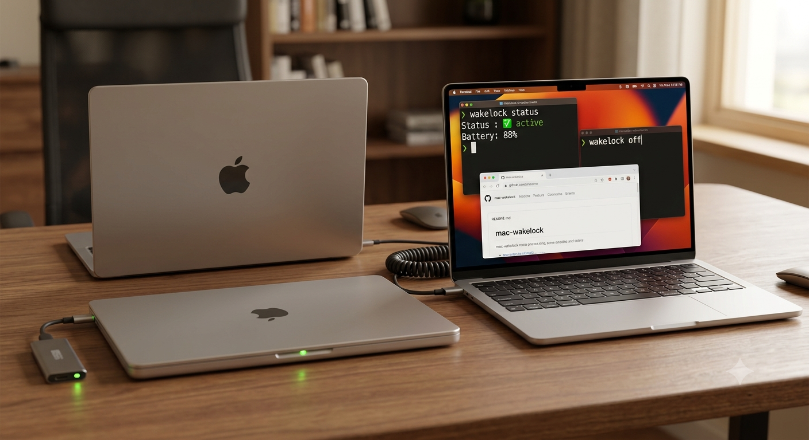

# mac-wakelock



> Keeps your MacBook **fully awake** — lid closed, on battery or AC power — with two terminal commands.
> Pure shell. No Java. No Homebrew. No background daemons.

---

## Why this exists

`caffeinate -s` only prevents sleep on AC power. Closing the lid on battery still suspends all processes. `mac-wakelock` uses `pmset` at the system level to prevent that entirely, and manages everything through a proper **launchd LaunchAgent** rather than fragile `nohup` processes.

---

## Compatibility

| macOS Version | Intel (x86_64) | Apple Silicon (arm64) | Notes |
|---|---|---|---|
| 15 Sequoia | ✅ | ✅ | Low Power Mode may override on battery — disable it in System Settings → Battery |
| 14 Sonoma | ✅ | ✅ | Fully supported |
| 13 Ventura | ✅ | ✅ | Fully supported |
| 12 Monterey | ✅ | ✅ | Fully supported |
| 11 Big Sur | ❌ | ❌ | Not supported (minimum is macOS 12) |

### Apple Silicon notes

On M1/M2/M3 Macs, `wakelock on` additionally disables:
- `hibernatemode` (prevents write-to-disk on sleep)
- `standby` (prevents entering standby/deep sleep)
- `autopoweroff` (prevents auto power-off while sleeping)

All are restored to their defaults by `wakelock off`.

---

## Requirements

- macOS 12 (Monterey) or later
- Admin access (for `pmset` — prompted once during install, then passwordless via sudoers)
- No Java, no Homebrew, no Python

---

## Installation

```bash
git clone https://github.com/kuum-oss/mac-wakelock
cd mac-wakelock
chmod +x install.sh && ./install.sh
```

The installer:

1. Detects your chip and macOS version
2. Copies `wakelock` and `monitor.sh` to `~/.wakelock/`
3. Adds `~/.wakelock` to your `PATH`
4. Writes a narrow sudoers rule — only for `/usr/bin/pmset`, nothing else
5. Prints a summary of what was installed

> You enter your password **once** during setup — never again for normal usage.

---

## Usage

```bash
wakelock on         # disable sleep (lid closed, battery, everything)
wakelock off        # restore normal sleep behavior
wakelock status     # show current state, battery level, pmset values
wakelock uninstall  # remove mac-wakelock completely
```

### Example session

```
$ wakelock on
🔧  Disabling sleep…
✅  Sleep disabled — battery, lid closed, everything
🔋  Battery monitor running (alert below 20%)
🍎  Apple Silicon: hibernation + standby also disabled

$ wakelock status
━━━━━━━━━━━━━━━━━━━━━━━━━━━━━━━━━━━━━━━━
  mac-wakelock status
━━━━━━━━━━━━━━━━━━━━━━━━━━━━━━━━━━━━━━━━
  State:         ✅ active
  Platform:      arm64 / macOS 14.5
  Battery:       61% (discharging)
  disablesleep:  1
  sleep timer:   0 min
━━━━━━━━━━━━━━━━━━━━━━━━━━━━━━━━━━━━━━━━

$ wakelock off
🔧  Restoring sleep settings…
✅  Normal sleep behavior restored
```

---

## How it works

```
pmset -a sleep 0          # disable idle sleep timer
pmset -a disablesleep 1   # prevent lid-close sleep (works on battery too)

# Apple Silicon only:
pmset -a hibernatemode 0  # no RAM dump to disk on sleep
pmset -a standby 0        # no standby (deep sleep)
pmset -a autopoweroff 0   # no auto power-off
```

The battery monitor is a **launchd LaunchAgent** (`com.kuum.wakelock.battery`) that runs every 60 seconds via `StartInterval`. It uses `KeepAlive/PathState` to automatically stop when `~/.wakelock/state` is removed — no manual cleanup needed. When battery drops below 20%, it fires a native macOS notification with the Sosumi sound.

---

## Security

### What sudo access is used for

`mac-wakelock` requires `sudo` **only** for `/usr/bin/pmset`. This is because `pmset -a` writes to system-level power management settings that affect all users and require root.

The sudoers rule written during install:

```
yourusername ALL=(root) NOPASSWD: /usr/bin/pmset
```

This is a **narrowly scoped** rule: it grants passwordless `sudo` for `pmset` only — not for `bash`, `sh`, or any other command. It is stored in `/etc/sudoers.d/mac-wakelock` and validated with `visudo -c` before being applied.

### Why not use IOKit directly?

The `IOPMAssertionCreateWithName` IOKit API (used by `caffeinate`) can prevent idle sleep without root, but it **cannot** prevent lid-close sleep on battery — only `pmset -a disablesleep 1` can do that, which requires root.

### Removing sudo access

```bash
wakelock uninstall
# or manually:
sudo rm /etc/sudoers.d/mac-wakelock
```

---

## Files installed

```
~/.wakelock/
├── wakelock         the CLI command (pure shell)
├── monitor.sh       battery monitor (managed by launchd)
├── monitor.log      monitor output
├── state            exists only while active (launchd KeepAlive target)
└── .monitor_warned  hysteresis flag for battery alerts

~/Library/LaunchAgents/
└── com.kuum.wakelock.battery.plist   launchd agent (StartInterval=60)

/etc/sudoers.d/
└── mac-wakelock     narrow pmset-only sudo rule
```

---

## Troubleshooting

### Mac still sleeps with lid closed

1. Check `wakelock status` — is `disablesleep: 1`?
2. On macOS 15+, disable **Low Power Mode**: System Settings → Battery → Low Power Mode → Off
3. On Apple Silicon, check that standby is disabled: `pmset -g | grep standby` should show `0`
4. Some MDM/corporate profiles can override `pmset` — check with your IT department

### Battery notification not appearing

1. Check System Settings → Notifications → Allow notifications for Script Editor / Terminal
2. Verify the launchd agent is loaded: `launchctl list | grep wakelock`
3. Check logs: `cat ~/.wakelock/monitor.log`

### `wakelock: command not found` after install

The installer adds `~/.wakelock` to your PATH in your shell rc file. Either:
- Restart your terminal, or
- Run: `export PATH="$HOME/.wakelock:$PATH"`

### `sudo: /usr/bin/pmset: command not found`

This should not happen on a standard macOS installation. Verify: `ls -la /usr/bin/pmset`

### Resetting pmset to defaults manually

```bash
sudo pmset -a disablesleep 0
sudo pmset -a sleep 1
# Apple Silicon:
sudo pmset -a hibernatemode 3
sudo pmset -a standby 1
sudo pmset -a autopoweroff 1
```

---

## ⚠️ Warnings

| Risk | Detail |
|------|--------|
| 🔋 Battery drain | The Mac won't sleep at all — battery drains faster than usual |
| 🌡️ Heat | Don't leave it in a closed bag for extended periods |
| 🔄 Persistence | Active across reboots if launchd loads the plist on login |
| 🔐 sudo | pmset requires root; the sudoers rule is scoped to `/usr/bin/pmset` only |

**Always run `wakelock off` when you no longer need it.**

---

## Uninstall

```bash
wakelock uninstall
```

This restores pmset defaults, removes the launchd agent, deletes `~/.wakelock/`, removes the sudoers rule, and cleans up your shell rc files.

---

## License

MIT